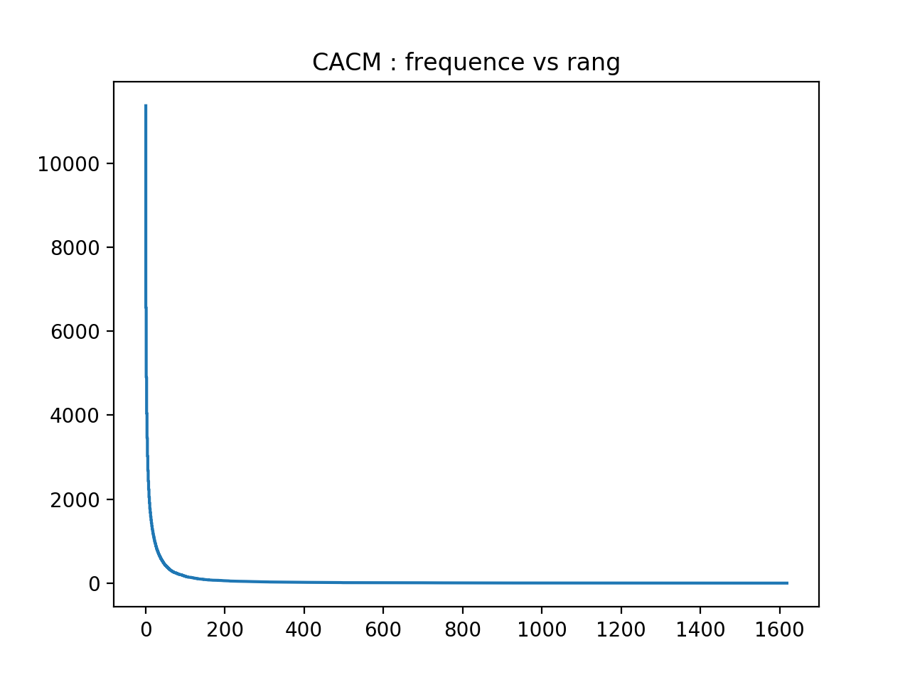
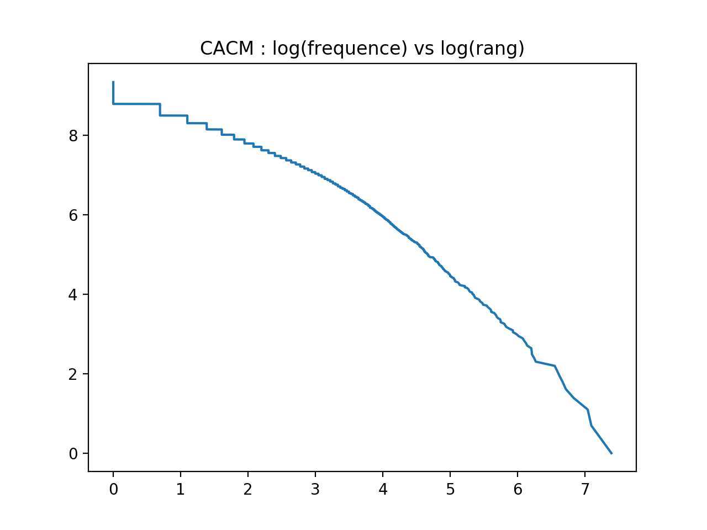
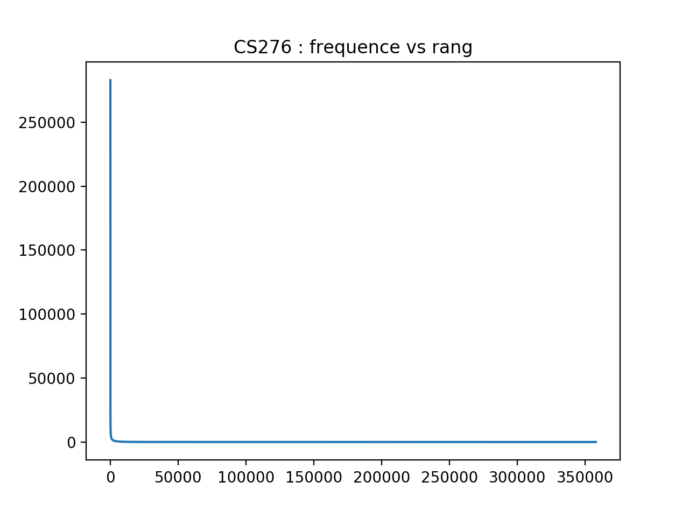
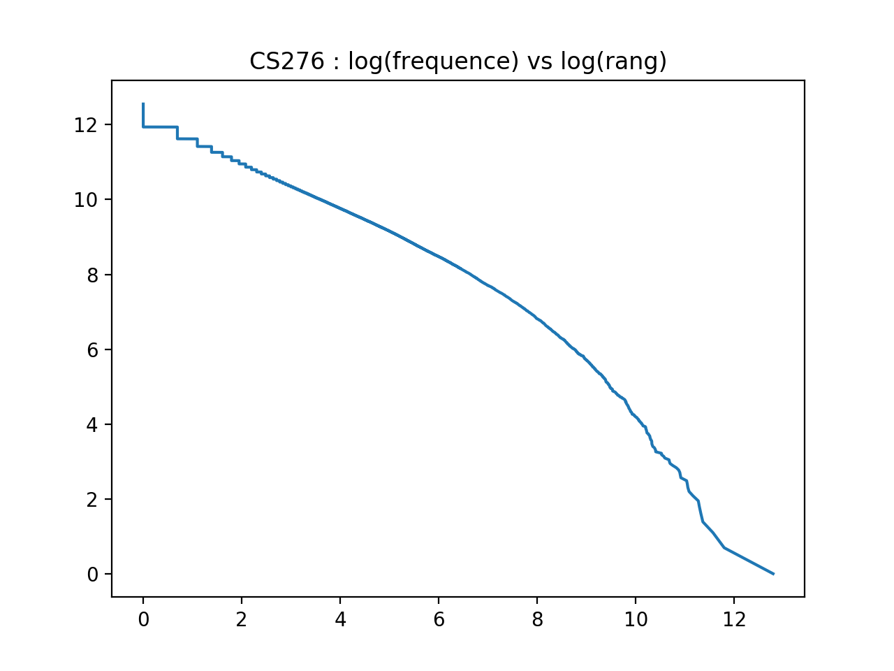

<h1 align='center'> Projet RI Web </h1>

<i>Option ISIA - Centrale Paris  
Janvier 2017 
</i>

__Auteur__ : Maxime ALLAIN 

## Index
1. [Installation](#installation)
2. [Initialisation et analyse des corpus](#init)
3. [Moteur de recherche booléen](#bool)
4. [Moteur de recherche vectoriel](#vect)

## 1. Installation

+ Cloner le repo git
+ Effectuer un `pip install -r requirement.txt`
+ Lancer `main.py` dans le dossier `CACM` (ou `CS276`)
+ Suivre les instructions dans la console python

## 2. Lecture et analyse des corpus

Réponse obtenue dans un terminal lors d'un test:

  >QUESTION 1: Nombre de tokens dans CACM: 113 778

  >QUESTION 2: Taille du vocabulaire : 11 366

  >QUESTION 3
  Valeur de b estimée: 0.499
  Valeur de k estimée: 33.989

  >QUESTION 4: Si on a 1 million de tokens, on peut estimer la taille du vocabulaire a 33 641

  >QUESTION 5: Chargement des graphes

Pour le corpus CS 276 on obtient les résultats suivants:

  >QUESTION 1: Nombre de tokens dans CS276: 15 898 451

  >QUESTION 2:
  >Taille du vocabulaire : 282 871

  >Valeur de b estimée:  0.923

  >Valeur de k estimée: 0.064

  >QUESTION 4: Si on a 1 million de tokens, on peut estimer la taille du vocabulaire a 22 045

  >QUESTION 5: Chargement des graphes

## 3. Moteur de recherche booléen

On trouvera ce moteur de recherches sous `C_boolean_model.py`.

Celui-ci est composé d'un moteur de recherche avec un seul mot, et également d'un moteur de recherche utilisant la forme normale conjonctive.

On donne un exemple de recherche effectuée dans le terminal avec l'algorithme booléen:

### Un seul mot

>/// Recherche d'un seul mot ///

>Entrez un mot :
>computer

>Temps de la requête : 0.000 seconde(s)
Voici les 622 documents dans lesquelles apparait le mot computer :

>Doc N°4 - Glossary of Computer Engineering and Programming Terminology
Doc N°7 - Glossary of Computer Engineering and Programming Terminology
Doc N°10 - Glossary of Computer Engineering and Programming Terminology
Doc N°13 - Glossary of Computer Engineering and Programming Terminology
Doc N°19 - Glossary of Computer Engineering and Programming Terminology
...

### Expression sous Forme Normale Conjonctive

>/// Requête bouléenne ///
Entrez une expression normale conjonctive sous le format ci-dessous.
AND : *
OR : +
NOT : -
Exemple : 1*2+3*4+-5 qui signifie 1 AND (2 OR 3) AND (4 OR NOT(5))

>algorithm\*graph+science\*-numerical

>Temps de la requête : 0.035 seconde(s)
>Voici les 43 documents dans lesquelles apparait le mot algorithm\*graph+science\*-numerical :

>Doc N°1481 - Graph Plotter (Algorithm 278 \[J6\])
Doc N°1504 - Algorithms for Finding a Fundamental Set of Cycles for an Undirected Linear Graph
Doc N°1727 - One Way of Estimating Frequencies of Jumps in a Program
...

## 4. Moteur de recherche vectoriel

On trouvera ce moteur de recherches sous `D_vectorial_model.py`.

Le moteur de recherche vectoriel utilise la mesure de similarité cosinus entre la requête et les documents.

Les méthodes implémentées pour mesurer la similarité sont les suivantes :
- tf_idf
- tf_idf normalisé
- Fréquence normalisée

On donne un exemple de recherche effectuée dans le terminal avec l'algorithme vectoriel :

>Entrez une requête sous la forme d'une suite de termes séparés par des espaces :

>analysis

>Quelle type de pondération souhaitez-vous tester ?
>1 - tf_idf
>2 - tf_idf normalisé
>3 - fréquence normalisée

>1

>Voici les 10 documents les plus pertinents pour la requête suivante 'analysis'
>274 documents trouvés en 0.031 seconde(s):

>Doc N°1404 - Computational Aspects of Multiple Covariance Analysis on a Multifactor Structure
>Doc N°1855 - A Program for the Syntactic Analysis of English Sentences
>Doc N°2050 - Automatic Parsing for Content Analysis
>Doc N°2923 - High-Level Data Flow Analysis
>Doc N°2494 - A Computer Generated Aid for Cluster Analysis
>Doc N°2719 - Mechanical Program Analysis
>Doc N°1679 - A Fast Fourier Transform Algorithm for Real-Valued Series
>Doc N°1989 - Transition Network Grammars for Natural Language Analysis
>Doc N°2437 - General Performance Analysis of Key-to-Address Transformation Methods Using an Abstract File  Concept

<<<<<<< HEAD
=======
NOTA BENE: Les valeurs suivantes ne sont pas présentes dans le fichier qrel.text pour juger de la pertinence de nos requêtes:
34,35,41,46,47,50,51,52,53,54,55,56. Dans ce cas là on indique que les fichiers pertinents pour cette requêtes étaient l'ensemble vide [].
, nous trouvons une taille de vocabulaire de 22045
>>>>>>> 6bcc5d88ea36e453a3693d681e7f1169974dab30
